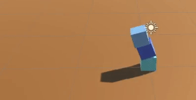
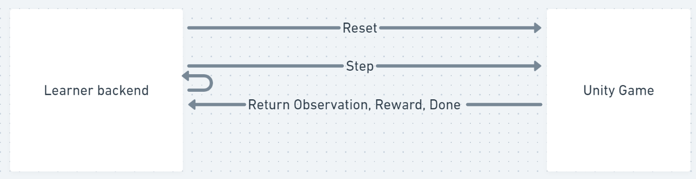

# ImprovementML Backend

This repo exists to capture the core ML side of ImprovementML, used in conjunction with the Unity backed game. The architecture I've designed is similar to Unity's ML Agents: a 2 way communication channel is established over TCP sockets, with a basic exchange protocol between the python learner and the unity agent.

See stevenire.land for project updates or technical progress.
